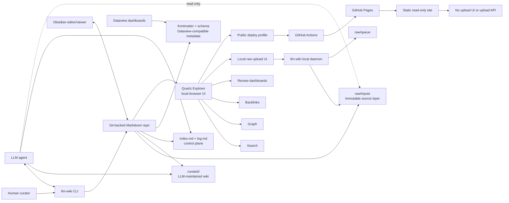
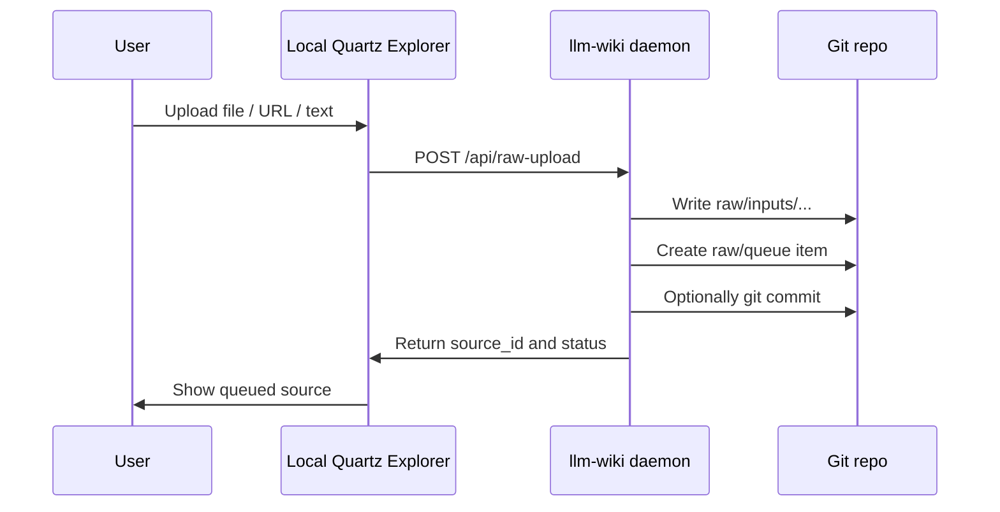
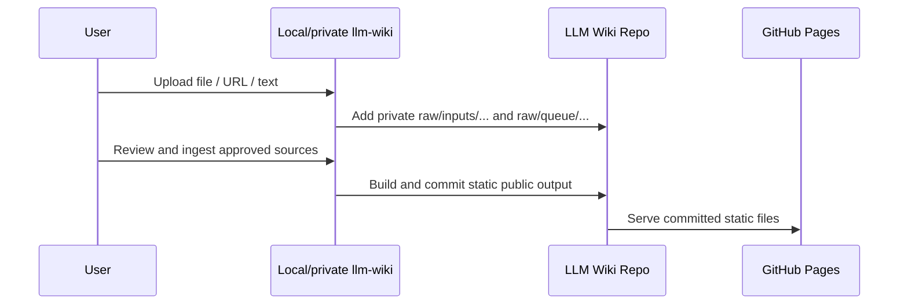

# Product Requirements Document: LLM Wiki CLI

**Product name:** `llm-wiki`  
**Document status:** Draft PRD  
**Last updated:** 2026-06-15  
**Primary artifact:** A CLI that creates and maintains a Git-backed, Obsidian-compatible, Quartz-explorable Markdown wiki for LLM-assisted knowledge work.  
**High-level architecture:** Obsidian Vault + Git + Quartz Explorer + Dataview + LLM Agent  
**Default deploy target:** GitHub Pages via GitHub Actions

---

## 1. Executive Summary

`llm-wiki` is a local-first CLI for creating and maintaining a durable LLM-maintained wiki. It turns a folder into a Git-backed Markdown knowledge repo with immutable raw sources, curated LLM-generated synthesis, an index/log control plane, local search and navigation helpers, Dataview-compatible metadata, and a Quartz-based browser interface.

The product is based on Andrej Karpathy's LLM Wiki pattern: instead of repeatedly retrieving raw chunks at query time, the LLM incrementally reads sources, integrates them into a persistent wiki, updates concept/entity/topic pages, tracks contradictions, maintains cross-references, and logs changes. The wiki becomes a compounding artifact rather than a temporary chat context. Karpathy's note describes the core layers as raw sources, the wiki, and a schema/instructions file, plus the operations of ingest, query, lint, indexing, and logging. [1]

The key product interpretation in this PRD is that **Quartz is not merely a publish layer**. Quartz is a first-class **local exploration interface** over the wiki. Publishing is one deployment mode of that same Quartz Explorer.

The daily workflow should look like this:

```bash
llm-wiki init ai-research-wiki --agent codex --obsidian --dataview --git
cd ai-research-wiki
llm-wiki explore init
llm-wiki add ~/Downloads/paper.pdf --title "Paper Title"
llm-wiki ingest src_2026_06_15_paper_title_a1b2c3
llm-wiki explore serve --profile local
```

When the user is ready to publish, the default path is GitHub Pages:

```bash
llm-wiki deploy github-pages init
llm-wiki deploy github-pages build-local
git add .github/workflows/llm-wiki-pages.yml .llm-wiki/profiles/
git commit -m "chore: add GitHub Pages deploy action"
git push
```

GitHub Pages deployment should use a generated GitHub Actions workflow that syncs the public Quartz profile, runs strict privacy/link checks, builds Quartz, uploads the static site as a Pages artifact, and deploys it to the `github-pages` environment. GitHub's documentation describes custom Pages workflows using checkout, static-site build, `actions/upload-pages-artifact`, and `actions/deploy-pages`, with Pages source configured as GitHub Actions. [2][3]

---

## 2. Background

Most document-based LLM workflows resemble retrieval-augmented generation. A user uploads files, the model retrieves relevant chunks at query time, and the answer is generated from those chunks. This is useful, but it does not compound. Each question asks the model to rediscover and reassemble knowledge from raw material.

The LLM Wiki pattern changes the unit of accumulation. The raw sources remain immutable. The LLM reads them once, extracts durable knowledge, updates a wiki of Markdown pages, tracks contradictions, links concepts, appends to a log, and makes the synthesis available for later use. New questions can become new pages. New sources can update old claims. The knowledge base is maintained as a living codebase.

This product turns that pattern into an opinionated CLI and repo structure.

The intended product stack is:

- **Obsidian Vault** for local editing, power-user navigation, Markdown, backlinks, and graph workflows.
- **Git** for version history, branches, collaboration, review, and rollback.
- **Quartz Explorer** for local browser-based reading, search, backlinks, graph navigation, review dashboards, and later static deployment.
- **Dataview-compatible metadata** for queryable dashboards inside the Markdown vault.
- **LLM Agent instructions** so tools such as Codex, Claude Code, OpenCode, or local agents can maintain the wiki consistently.

Quartz 5 describes itself as a static-site generator that transforms Markdown content into fully functional websites, requires Node/npm, supports local builds, and includes features suited to an Obsidian-style digital garden such as search, graph navigation, wikilinks, and site exploration. [4][5]

---

## 3. Problem Statement

People want LLM-maintained personal or team wikis, but the setup is currently ad hoc. Users must invent their own raw/source separation, choose Markdown conventions, maintain source cards, write agent instructions, manually update indexes and logs, wire up local search, configure Obsidian, decide how publishing works, and avoid accidentally leaking private sources.

The product should make the LLM Wiki pattern easy to start, safe to maintain, pleasant to explore locally, and straightforward to deploy publicly when desired.

The product should not feel like a hosted RAG platform. It should feel like a disciplined local knowledge repo with strong tooling.

---

## 4. Product Definition

`llm-wiki` is a local-first CLI that turns a folder into a Git-backed, Obsidian-compatible, Quartz-explorable, LLM-maintained Markdown wiki.

It creates and manages:

- An immutable raw source layer.
- A curated LLM-maintained wiki layer.
- Agent instruction files.
- A human-readable and machine-parseable index/log control plane.
- Local search and navigation helpers.
- Dataview-compatible frontmatter and dashboards.
- A Quartz Explorer for local browser-based reading and review.
- A GitHub Pages-first deployment path for public Quartz output.
- Optional local/private upload workflows that add new raw sources into the repo before reviewed static publication.

One-sentence version:

> `llm-wiki` is a local-first CLI that creates a Git-backed, Obsidian-compatible, Quartz-explorable LLM Wiki with immutable raw sources, curated synthesis, index/log control files, local browser exploration, search/navigation tooling, Dataview-compatible metadata, and a GitHub Pages deploy action for public output.

---

## 5. Product Goals

### 5.1 Git-backed by default

Every meaningful change should be visible in Git diffs and recoverable through history. Ingest operations should be branch-friendly and reviewable.

### 5.2 Raw/curated separation

Raw sources are immutable source-of-truth inputs. Curated pages are LLM-maintained outputs. The LLM may read raw inputs but must not rewrite captured originals.

### 5.3 Obsidian-compatible

The repo should open directly as an Obsidian vault. It should use Markdown, YAML frontmatter, wikilinks, tags, local assets, and Dataview-compatible metadata.

### 5.4 Quartz-explorable from day one

Quartz should be initialized as a local browser exploration interface, not only as a later publishing step. The user should be able to run:

```bash
llm-wiki explore serve --profile local
```

and browse, search, review, and navigate the wiki locally.

### 5.5 Agent-friendly

The repo should include `AGENTS.md`, plus optional agent-specific variants such as `CLAUDE.md` and `CODEX.md`, so LLM coding agents understand how to ingest, query, lint, and maintain the wiki.

### 5.6 Control-plane driven

`curated/index.md` should be the content-oriented map of the wiki. `curated/log.md` should be the chronological operational ledger. Both should be human-readable and machine-parseable.

### 5.7 Searchable and navigable locally

The CLI should support terminal search/navigation, while Quartz provides richer browser-based exploration with search, backlinks, graph view, and reading flows.

### 5.8 Deployable through GitHub Pages

Public deployment should be GitHub Pages-first. The CLI should generate a GitHub Actions workflow that builds the public Quartz profile and deploys it through official GitHub Pages artifact and deploy actions.

### 5.9 Safe by default

Private raw sources, private curated pages, internal logs, source queues, and review dashboards must not be included in public deploys unless explicitly configured.

### 5.10 Upload-capable through local/private modes

The Quartz UI should be able to support raw source upload:

- Locally through a local `llm-wiki daemon`.
- Through a privately hosted `llm-wiki` instance when explicitly configured outside GitHub Pages.
- Never from GitHub Pages static output.

---

## 6. Non-Goals

The MVP should not be:

- A full hosted SaaS platform.
- A full RAG/vector database platform.
- A replacement for Obsidian.
- A replacement for GitHub, GitLab, or Forgejo.
- A full CMS.
- A guarantee that LLM-maintained content is correct.
- A system that automatically publishes unreviewed or private material.
- A public file-hosting service for arbitrary uploads.
- A general-purpose website builder unrelated to the LLM Wiki workflow.

---

## 7. Personas

### 7.1 Individual researcher or analyst

A person gathering papers, articles, PDFs, notes, transcripts, and web clips over weeks or months. They want synthesis to compound instead of restarting from scratch in every chat.

### 7.2 LLM-agent power user

A user who already works with CLI coding agents and wants a disciplined Markdown repo that an agent can safely maintain.

### 7.3 Team knowledge steward

A person responsible for maintaining an internal wiki from meeting notes, Slack exports, project docs, customer calls, retrospectives, or research memos.

### 7.4 Public digital-garden publisher

A user who wants to publish selected curated notes through Quartz and GitHub Pages while keeping raw sources and private notes local.

### 7.5 Reviewer / editor

A human who reviews recent LLM edits, checks contradictions, approves public pages, and validates source provenance.

---

## 8. User Stories

### 8.1 Project creation

As a user, I want to run:

```bash
llm-wiki init my-research-wiki
```

so that I get a Git-backed Markdown repo with a known structure, initial templates, agent instructions, index/log files, and Obsidian-compatible conventions.

### 8.2 Quartz local exploration

As a user, I want to run:

```bash
llm-wiki explore init
llm-wiki explore serve --profile local
```

so that I can browse the wiki in a local web UI with search, graph navigation, backlinks, wikilinks, source status, and review dashboards.

### 8.3 Raw source capture

As a user, I want to add files, URLs, or pasted text to `raw/inputs` without the LLM modifying the original material.

```bash
llm-wiki add ~/Downloads/paper.pdf --title "Attention Is All You Need" --tags transformers,history
llm-wiki add-url "https://example.com/article" --title "Market overview"
llm-wiki add-text --title "Meeting notes 2026-06-15"
```

### 8.4 LLM ingest

As a user, I want the CLI to prepare an ingest task for my configured LLM agent, then validate the agent's edits.

```bash
llm-wiki ingest src_2026_06_15_attention_a1b2c3
```

The agent should summarize the source, update relevant topic/entity/concept pages, update `index.md`, append to `log.md`, and preserve provenance back to source IDs.

### 8.5 Query and file-back

As a user, I want to ask a question against the curated wiki and optionally file the answer back as a durable page.

```bash
llm-wiki query "What are the strongest arguments against this thesis?" \
  --save curated/questions/arguments-against-thesis.md
```

### 8.6 Review

As a user, I want to open a review-focused local Quartz profile showing recent changes, pages needing review, contradictions, stale pages, orphan pages, and source queue state.

```bash
llm-wiki explore serve --profile review
```

### 8.7 Health check

As a user, I want the CLI and/or LLM agent to lint the wiki for broken links, missing metadata, orphan pages, contradictions, stale claims, and unprocessed sources.

```bash
llm-wiki lint
```

### 8.8 GitHub Pages deploy

As a user, I want the CLI to generate a GitHub Pages deploy action for my public Quartz profile.

```bash
llm-wiki deploy github-pages init
llm-wiki deploy github-pages build-local
```

### 8.9 Raw upload from local Explorer

As a user, I want the local Quartz Explorer to provide an upload form backed by a local daemon so I can add new raw sources from the browser.

```bash
llm-wiki explore serve --profile local --with-daemon
```

### 8.10 Static publication from reviewed uploads

As a maintainer, I want uploads to happen in local/private `llm-wiki`, then publish reviewed static output through a repo branch or PR for GitHub Pages to serve.

---

## 9. High-Level Architecture



---

## 10. Architectural Principles

### 10.1 Repo is the source of truth

The Markdown repo is the durable product. CLI caches, Quartz content, and static build outputs are derived artifacts.

### 10.2 Raw is immutable

Captured originals under `raw/inputs/**/original.*` must not be modified. If a source needs normalization or extraction, create derived files such as `extracted.md` or `normalized.md`.

### 10.3 Curated is LLM-maintained but human-reviewable

The LLM can create and edit pages under `curated/`, but all changes should be visible in Git diffs and subject to lint/review workflows.

### 10.4 Index/log are control-plane files

The wiki should not rely solely on hidden JSON state. `index.md` and `log.md` make state visible to humans and agents.

### 10.5 Quartz is local UI, not just publishing

Quartz should be available from the beginning as the local browser-native exploration surface. Public publishing is a filtered deployment profile of the same Explorer.

### 10.6 GitHub Pages is the default public deploy path

The first-class deploy target is a generated GitHub Actions workflow for GitHub Pages.

### 10.7 Privacy is profile-based

Local and review profiles may include private information. Public deploy profiles must be strict and fail closed.

---

## 11. Repository Structure

```text
my-wiki/
  .git/
  .gitignore
  README.md

  AGENTS.md
  CLAUDE.md
  CODEX.md

  .github/
    workflows/
      llm-wiki-pages.yml

  .llm-wiki/
    config.yml
    schema.yml
    cache/
      pages.json
      sources.json
      graph.json
      search.sqlite
      quartz-manifest.local.json
      quartz-manifest.review.json
      quartz-manifest.public.json
    templates/
      source-card.md
      source-summary.md
      entity.md
      concept.md
      topic.md
      question.md
      comparison.md
      review-page.md
      log-entry.md
    checks/
      lint-rules.yml
    profiles/
      local.yml
      review.yml
      public.yml
      github-pages.yml
      private-team.yml

  raw/
    README.md
    inputs/
      2026/
        06/
          src_2026_06_15_karpathy_llm_wiki_a1b2c3/
            _source.md
            original.md
            extracted.md
            assets/
    queue/
      src_2026_06_15_karpathy_llm_wiki_a1b2c3.json
    assets/

  curated/
    index.md
    log.md
    home.md
    map.md
    contradictions.md
    open-questions.md

    sources/
      src_2026_06_15_karpathy_llm_wiki_a1b2c3.md

    entities/
    concepts/
    topics/
    questions/
    comparisons/
    dashboards/
      sources.md
      stale-pages.md
      contradictions.md
      ingestion-queue.md
      review.md

  quartz/
    README.md
    quartz.config.yaml
    quartz.layout.ts
    package.json
    package-lock.json
    content/
      # generated/synced by llm-wiki explore sync
    public/
      # generated by Quartz build; gitignored by default
    components/
      LlmWikiUpload.tsx
      LlmWikiSourceStatus.tsx
      LlmWikiReviewPanel.tsx
    plugins/
      llmWikiManifest.ts
      llmWikiVisibilityFilter.ts
      llmWikiSourceBadges.ts
    profiles/
      local.yaml
      review.yaml
      public.yaml
```

### 11.1 Directory responsibilities

| Path | Purpose | LLM write access |
|---|---|---:|
| `raw/inputs/` | Immutable source files, source cards, extracted text, assets | No, except creating new source folders through CLI-mediated workflows |
| `raw/queue/` | Sources waiting for ingestion | CLI writes; LLM may propose status through CLI |
| `curated/` | LLM-maintained Markdown wiki | Yes |
| `curated/index.md` | Content-oriented map of the wiki | Yes, required update on ingest |
| `curated/log.md` | Append-only operational ledger | Append only |
| `.llm-wiki/` | CLI config, schemas, profiles, caches, manifests | CLI writes |
| `.llm-wiki/profiles/local.yml` | Local Quartz Explorer inclusion rules | Human + CLI |
| `.llm-wiki/profiles/public.yml` | Public deploy inclusion/privacy rules | Human + CLI |
| `.github/workflows/llm-wiki-pages.yml` | Generated GitHub Pages workflow | CLI generates, human reviews |
| `quartz/` | Local exploration and deployable site runtime | CLI writes configuration; Quartz builds output |
| `quartz/content/` | Generated/synced Quartz-readable content | CLI writes |
| `quartz/public/` | Built static output | Generated, gitignored by default |

---

## 12. Core Data Model

### 12.1 Source ID

Every raw source gets a deterministic ID:

```text
src_<yyyy>_<mm>_<dd>_<slug>_<short_hash>
```

Example:

```text
src_2026_06_15_karpathy_llm_wiki_a1b2c3
```

The short hash is derived from the raw file content or URL capture payload. This supports duplicate detection and integrity checks.

### 12.2 Raw source card

Every raw input folder contains `_source.md`.

```markdown
---
type: raw_source
source_id: src_2026_06_15_karpathy_llm_wiki_a1b2c3
title: "Karpathy LLM Wiki"
source_kind: markdown
origin: web
origin_url: "https://gist.github.com/karpathy/442a6bf555914893e9891c11519de94f"
captured_at: 2026-06-15T10:00:00+10:00
content_hash: sha256:a1b2c3...
status: queued
visibility: private
tags:
  - llm-wiki
  - knowledge-management
curated_summary: ""
ingested_at:
supersedes:
superseded_by:
---

# Raw Source Card

Original file: [[original.md]]

## Capture notes

## Human notes

## Ingest status

- Status: queued
- Curated summary:
```

### 12.3 Queue item

```json
{
  "source_id": "src_2026_06_15_karpathy_llm_wiki_a1b2c3",
  "title": "Karpathy LLM Wiki",
  "status": "queued",
  "created_at": "2026-06-15T10:00:00+10:00",
  "source_card": "raw/inputs/2026/06/src_2026_06_15_karpathy_llm_wiki_a1b2c3/_source.md",
  "original_path": "raw/inputs/2026/06/src_2026_06_15_karpathy_llm_wiki_a1b2c3/original.md",
  "requested_ingest": false,
  "priority": "normal",
  "tags": ["llm-wiki", "knowledge-management"]
}
```

### 12.4 Curated source summary

```markdown
---
type: source_summary
source_id: src_2026_06_15_karpathy_llm_wiki_a1b2c3
title: "Karpathy LLM Wiki"
created: 2026-06-15
updated: 2026-06-15
source_kind: markdown
source_path: raw/inputs/2026/06/src_2026_06_15_karpathy_llm_wiki_a1b2c3/original.md
status: active
visibility: private
confidence: medium
tags:
  - llm-wiki
  - source-summary
---

# Karpathy LLM Wiki

## Summary

## Key claims

## Useful concepts

## Links created or updated

## Contradictions or tensions

## Open questions

## Source references

- Raw source card: [[src_2026_06_15_karpathy_llm_wiki_a1b2c3]]
```

### 12.5 Curated wiki page

```markdown
---
type: concept
title: "Persistent Compounding Wiki"
aliases:
  - LLM Wiki
  - Compounding knowledge base
created: 2026-06-15
updated: 2026-06-15
status: active
visibility: public
source_ids:
  - src_2026_06_15_karpathy_llm_wiki_a1b2c3
source_count: 1
review_status: needs-human-review
next_review: 2026-07-15
tags:
  - concept
  - knowledge-management
---

# Persistent Compounding Wiki

## Definition

## Why it matters

## Related concepts

- [[Raw source]]
- [[Curated wiki]]
- [[Index control plane]]
- [[Contradiction tracking]]

## Evidence

## Open questions
```

### 12.6 Log entry

`curated/log.md` should be append-only and parseable.

```markdown
# Log

## [2026-06-15T10:42:00+10:00] ingest | src_2026_06_15_karpathy_llm_wiki_a1b2c3 | Karpathy LLM Wiki

- actor: llm-agent
- command: `llm-wiki ingest src_2026_06_15_karpathy_llm_wiki_a1b2c3`
- git_branch: ingest/src_2026_06_15_karpathy_llm_wiki_a1b2c3
- git_commit: pending
- raw_source: [[src_2026_06_15_karpathy_llm_wiki_a1b2c3]]
- created:
  - [[Karpathy LLM Wiki]]
  - [[Persistent Compounding Wiki]]
- updated:
  - [[index]]
  - [[map]]
- contradictions:
  - none
- follow_ups:
  - Compare LLM Wiki pattern against RAG-heavy knowledge bases.
```

---

## 13. CLI Command Model

### 13.1 Command overview

| Command | Purpose |
|---|---|
| `llm-wiki init` | Create the Git-backed LLM Wiki repo |
| `llm-wiki add` | Add local file to raw inputs |
| `llm-wiki add-url` | Capture URL into raw inputs |
| `llm-wiki add-text` | Add pasted/manual text |
| `llm-wiki ingest` | Prepare/run LLM ingest workflow |
| `llm-wiki queue` | View/manage pending sources |
| `llm-wiki search` | Terminal search over raw/curated Markdown |
| `llm-wiki nav` | Terminal navigation: backlinks, outlinks, orphans, source relations |
| `llm-wiki query` | Ask a question against curated wiki context |
| `llm-wiki lint` | Validate repo health |
| `llm-wiki index rebuild` | Rebuild machine indexes from Markdown/frontmatter |
| `llm-wiki log` | Read/append structured log entries |
| `llm-wiki status` | Show repo, queue, Git, and Explorer state |
| `llm-wiki snapshot` | Commit current state with standard message |
| `llm-wiki explore init` | Initialize Quartz Explorer |
| `llm-wiki explore sync` | Sync selected wiki content into Quartz content |
| `llm-wiki explore serve` | Serve local Quartz Explorer |
| `llm-wiki explore open` | Open local Explorer in browser |
| `llm-wiki explore build` | Build local Explorer bundle |
| `llm-wiki daemon` | Run local write API for uploads and local UI actions |
| `llm-wiki deploy github-pages init` | Generate GitHub Pages workflow/config |
| `llm-wiki deploy github-pages check` | Validate GitHub Pages deploy readiness |
| `llm-wiki deploy github-pages build-local` | Run public deploy preflight locally |
| `llm-wiki deploy github-pages status` | Show deploy state and workflow hints |
| `llm-wiki upload init` | Scaffold local/remote raw upload workflow |

---

## 14. Core CLI Requirements

### 14.1 `init`

```bash
llm-wiki init my-wiki \
  --agent codex \
  --obsidian \
  --dataview \
  --git \
  --quartz-ready
```

Requirements:

- Creates directory structure.
- Runs `git init` unless `--no-git`.
- Creates `curated/index.md` and `curated/log.md`.
- Creates `AGENTS.md` and optional agent-specific files.
- Creates Dataview dashboards if `--dataview`.
- Creates `.obsidian` starter config only if requested.
- Creates `.llm-wiki/config.yml`.
- Creates initial commit when Git is enabled.
- If `--quartz-ready`, creates profile files needed by future `explore init`.

Acceptance criteria:

- User can open the folder in Obsidian.
- `llm-wiki status` returns no critical errors.
- `git status` is clean after init.
- `curated/index.md` and `curated/log.md` exist and follow schema.

### 14.2 `add`

```bash
llm-wiki add ./paper.pdf --title "Paper Title" --tags ai,research
```

Requirements:

- Copies original source into `raw/inputs/YYYY/MM/<source_id>/`.
- Computes content hash.
- Creates `_source.md`.
- Adds a queue item in `raw/queue/`.
- Does not modify existing raw source content.
- Detects duplicates by hash.
- Optionally extracts text to `extracted.md` for PDFs or rich files.

Acceptance criteria:

- Source can be found through `llm-wiki queue`.
- Source card appears in Obsidian and Dataview.
- Duplicate file triggers warning or creates a linked duplicate record.

### 14.3 `add-url`

```bash
llm-wiki add-url "https://example.com/article" --title "Article Title"
```

Requirements:

- Captures URL metadata.
- Saves canonical URL in source card.
- Stores fetched Markdown/text when extraction is available.
- Stores original HTML or a normalized representation according to config.
- Creates source ID, raw source card, and queue item.

MVP may support URL capture as a lightweight metadata/text operation and defer robust article extraction.

### 14.4 `add-text`

```bash
llm-wiki add-text --title "Meeting notes 2026-06-15"
```

Requirements:

- Accepts pasted text from stdin or editor.
- Stores text as `original.md`.
- Creates source ID, source card, and queue item.

### 14.5 `ingest`

```bash
llm-wiki ingest src_2026_06_15_karpathy_llm_wiki_a1b2c3
```

Requirements:

- Creates or checks out an ingest branch if configured.
- Generates an ingest prompt/task for the configured LLM agent.
- Provides the agent with:
  - Source card.
  - Raw/extracted content path.
  - Relevant existing index entries.
  - Wiki conventions from `AGENTS.md`.
  - Required output checklist.
- Validates resulting edits.
- Requires `index.md` and `log.md` updates.
- Marks queue item as `ingested` only after validation passes.

Agent rules:

- Agent must not edit raw original files.
- Agent must update relevant pages, not just create a source summary.
- Agent must add source references to edited pages.
- Agent must flag contradictions rather than silently resolving them.
- Agent must add open questions where evidence is incomplete.
- Agent must append to `log.md`.

Acceptance criteria:

- Ingesting one source creates a curated source summary.
- At least one index entry is added or updated.
- Log entry is appended.
- Raw source hash remains unchanged.
- Lint passes or reports actionable warnings.

### 14.6 `search`

```bash
llm-wiki search "contradictions in pricing model"
llm-wiki search "transformer architecture" --scope curated --json
```

MVP requirements:

- Use local full-text search over Markdown files.
- Support `--scope raw`, `--scope curated`, and `--scope all`.
- Support JSON output for agents.
- Search page titles, aliases, tags, headings, and body text.

Post-MVP:

- SQLite FTS index.
- Optional QMD adapter.
- Optional MCP server.
- Optional embeddings.

Acceptance criteria:

- Search returns file path, title, page type, snippet, and score.
- Agent-readable `--json` output is stable.
- Search works offline.

### 14.7 `nav`

```bash
llm-wiki nav backlinks "Persistent Compounding Wiki"
llm-wiki nav orphans
llm-wiki nav sources "Persistent Compounding Wiki"
llm-wiki nav graph --json
```

Requirements:

- Show backlinks and outlinks.
- Show orphan pages.
- Show pages by source ID.
- Show stale pages by `next_review`.
- Export graph as JSON.
- Support Obsidian-style `[[wikilinks]]`.

Acceptance criteria:

- `nav backlinks` matches links found in Markdown.
- `nav orphans` excludes configured system pages.
- `nav graph --json` can feed a visualization.

### 14.8 `lint`

```bash
llm-wiki lint
llm-wiki lint --fix
llm-wiki lint --profile public --strict
```

Lint categories:

- Broken wikilinks.
- Missing required frontmatter.
- Invalid frontmatter types.
- Missing source IDs on curated pages.
- Raw source modified after ingest.
- Queue item without source card.
- Source card without curated summary after ingestion.
- Log entries with invalid timestamp format.
- `index.md` missing known page.
- Orphan pages.
- Pages with `review_status: needs-human-review`.
- Public page links to private page.
- Public page links to raw source.
- Public graph/search leak risks.
- Quartz profile conflicts.
- GitHub Pages deploy profile errors.

Acceptance criteria:

- Lint exits non-zero on critical errors.
- Lint emits machine-readable JSON with `--json`.
- `--fix` only performs safe deterministic fixes.

---

## 15. Agent Instruction Requirements

`AGENTS.md` is central to the product. It should be generated by the CLI and customized over time.

Minimum required structure:

```markdown
# LLM Wiki Agent Instructions

## Mission

Maintain this repo as a persistent, compounding LLM Wiki.

## Hard rules

1. Never modify files under `raw/inputs/**/original.*`.
2. Treat raw inputs as source of truth.
3. Write and update curated Markdown pages under `curated/`.
4. Use Obsidian wikilinks.
5. Preserve provenance through `source_ids`.
6. Update `curated/index.md` after every ingest.
7. Append to `curated/log.md` after every ingest, query save, or lint pass.
8. Flag contradictions explicitly.
9. Do not invent missing facts.
10. Prefer updating existing pages over creating duplicates.
11. Respect page `visibility`.
12. Never make private/raw content public without explicit human instruction.

## Page types

- source_summary
- entity
- concept
- topic
- question
- comparison
- dashboard

## Ingest workflow

## Query workflow

## Lint workflow

## Review workflow

## Frontmatter schema

## Citation and provenance conventions

## Public/private visibility rules

## Quartz Explorer profile rules
```

Acceptance criteria:

- A new agent session can read `AGENTS.md` and understand how to operate.
- The CLI can validate that key rules are present.
- Agent instructions are model-agnostic, with optional generated variants for specific tools.

---

## 16. Control Plane

### 16.1 `curated/index.md`

Purpose: content-oriented navigation map.

Required structure:

```markdown
# Index

## Overview

## Sources

| Source | Status | Summary | Key pages |
|---|---|---|---|

## Concepts

| Page | Summary | Source count | Updated |
|---|---:|---:|---|

## Entities

## Topics

## Questions

## Comparisons

## Dashboards

## Needs review

## Orphans / weakly connected pages
```

Requirements:

- Updated on every ingest.
- Can be regenerated with `llm-wiki index rebuild`.
- Useful to both humans and LLM agents.
- Not the only source of truth; frontmatter and machine cache also support state.

### 16.2 `curated/log.md`

Purpose: chronological operational history.

Requirements:

- Append-only.
- Timestamped entries.
- Parseable heading prefix.
- Includes operation type: `init`, `add`, `ingest`, `query`, `lint`, `explore`, `deploy`, `upload`.
- Includes affected source/page IDs.
- Includes branch/commit when available.

Example heading:

```markdown
## [2026-06-15T10:42:00+10:00] ingest | src_2026_06_15_karpathy_llm_wiki_a1b2c3 | Karpathy LLM Wiki
```

---

## 17. Quartz Explorer

### 17.1 Principle

Quartz is a first-class local UI runtime for the wiki.

It should support:

- Browser-based reading.
- Search.
- Backlinks.
- Graph navigation.
- Wikilinks.
- Popover previews where supported.
- Review dashboards.
- Source status surfaces.
- Local upload UI when daemon is running.
- Public deploy output through profiles.

Quartz is not tucked under `publish/`. It lives at:

```text
quartz/
```

### 17.2 `explore init`

```bash
llm-wiki explore init
```

Requirements:

- Creates `quartz/` runtime directory.
- Installs or checks Quartz dependencies, or prints precise install instructions.
- Creates Quartz configuration suitable for local exploration.
- Creates profile-aware sync config.
- Adds LLM Wiki-specific components:
  - Source status badges.
  - Review panel.
  - Raw upload form.
  - Queue dashboard.
  - Visibility warnings.
- Configures Quartz search, backlinks, graph, and wikilink handling.
- Creates a local home page pointing to:
  - `curated/home.md`
  - `curated/index.md`
  - `curated/log.md`
  - review dashboard
  - source queue
  - contradictions
  - open questions

Acceptance criteria:

- `llm-wiki explore serve` starts a local browser UI.
- The local Explorer can navigate curated pages.
- Search works over selected profile content.
- Wikilinks resolve.
- Backlinks display.
- Graph view is available if configured.
- Raw source cards are visible in local mode.
- Raw source originals are not exposed in public mode.

### 17.3 `explore sync`

```bash
llm-wiki explore sync --profile local
```

Purpose:

Generate or update `quartz/content/` from canonical repo content.

The sync process should:

- Read `.llm-wiki/profiles/<profile>.yml`.
- Select eligible files.
- Copy or materialize files into `quartz/content/`.
- Rewrite links if needed.
- Add generated Explorer pages.
- Generate manifest files.
- Exclude private/raw files based on profile.
- Fail on unsafe links in public profiles.

### 17.4 `explore serve`

```bash
llm-wiki explore serve --profile local
```

Requirements:

- Runs `explore sync`.
- Starts Quartz local server.
- Optionally starts `llm-wiki daemon` for local uploads/actions.
- Shows local URL.
- Watches for changes to `curated/`, source cards, and config.
- Rebuilds on content changes.
- Does not expose raw originals unless explicitly configured.
- Defaults to `localhost` only.

Acceptance criteria:

- User can browse the wiki in a browser without deploying anything.
- User can search from the browser.
- User can click wikilinks and backlinks.
- User can inspect source status.
- User can see queue and review dashboards.
- User can optionally upload a raw source locally.

---

## 18. Quartz Explorer Profiles

### 18.1 Local profile

The local profile is for personal/private exploration.

It should include:

- Curated public and private pages.
- Curated source summaries.
- Dashboards.
- Review pages.
- Queue/status pages.
- Raw source cards.
- Links to local raw files where safe.
- Upload UI backed by local `llm-wiki daemon`.
- Full graph/search over the local wiki.

Example:

```bash
llm-wiki explore serve --profile local
```

Example profile:

```yaml
name: local
mode: local-exploration
include:
  - curated/**
  - raw/inputs/**/_source.md
  - raw/queue/**
exclude:
  - raw/inputs/**/original.*
  - .git/**
visibility:
  include_private: true
features:
  search: true
  graph: true
  backlinks: true
  upload: true
  review_panel: true
source_links:
  allow_local_file_links: true
```

### 18.2 Review profile

The review profile is for validating recent LLM or upload changes.

It should include:

- New or changed pages.
- Recently ingested sources.
- Pages marked `review_status: needs-human-review`.
- Contradictions.
- Open questions.
- Broken or weak links.
- Source pages with missing summaries.
- Upload queue.

Example:

```bash
llm-wiki explore serve --profile review
```

Generated review pages:

```text
quartz/content/_llm-wiki/review/index.md
quartz/content/_llm-wiki/review/recent-ingests.md
quartz/content/_llm-wiki/review/needs-human-review.md
quartz/content/_llm-wiki/review/contradictions.md
quartz/content/_llm-wiki/review/orphans.md
quartz/content/_llm-wiki/review/source-queue.md
quartz/content/_llm-wiki/review/private-link-leaks.md
```

### 18.3 Public profile

The public profile is for deployable output.

It should include only:

- Pages with `visibility: public`.
- Public-safe assets.
- Public-safe backlinks.
- Public-safe graph nodes.
- Public-safe search index entries.

It should exclude:

- `raw/**` by default.
- Private curated pages.
- Private source summaries.
- Internal dashboards.
- Queue files.
- Log entries unless explicitly public.
- Pages that link to private/raw sources.

Example profile:

```yaml
name: public
mode: deploy
include:
  - curated/**
exclude:
  - raw/**
  - curated/dashboards/private/**
  - curated/sources/**
  - curated/log.md
visibility:
  include_private: false
  required_value: public
features:
  search: true
  graph: true
  backlinks: true
  upload: false
source_links:
  allow_local_file_links: false
safety:
  fail_on_private_links: true
  fail_on_raw_links: true
  fail_on_missing_visibility: true
  fail_on_public_graph_private_nodes: true
  fail_on_public_search_private_text: true
```

### 18.4 Private team profile

The private team profile is for deploying the Explorer behind authentication.

It may include:

- Private curated pages.
- Team dashboards.
- Source summaries.
- Internal review views.
- Upload form.
- Comment/review integrations.

This profile is post-MVP.

---

## 19. Quartz Deploy: GitHub Pages Action

### 19.1 Principle

Quartz Deploy should be **GitHub Pages-first**.

The local Quartz Explorer remains the daily browser interface:

```bash
llm-wiki explore serve --profile local
```

The public site is produced by a generated GitHub Pages workflow:

```bash
llm-wiki deploy github-pages init
```

Publishing is not modeled as “copy a static folder somewhere.” Instead, `llm-wiki` generates and validates a GitHub Actions workflow that:

1. Checks out the repo.
2. Installs Node/Quartz dependencies.
3. Installs the `llm-wiki` CLI.
4. Runs `llm-wiki explore sync --profile public`.
5. Runs `llm-wiki lint --profile public --strict`.
6. Installs Quartz plugins if needed.
7. Builds Quartz.
8. Uploads the generated static site as a GitHub Pages artifact.
9. Deploys that artifact to the `github-pages` environment.

GitHub's Pages documentation recommends a custom GitHub Actions workflow when a site needs a build process other than Jekyll or does not use a dedicated branch for compiled static files. [2]

### 19.2 Command model

```bash
llm-wiki deploy github-pages init
llm-wiki deploy github-pages check
llm-wiki deploy github-pages build-local
llm-wiki deploy github-pages status
```

| Command | Purpose |
|---|---|
| `llm-wiki deploy github-pages init` | Generate GitHub Pages workflow, deploy profile, and config |
| `llm-wiki deploy github-pages check` | Validate repo, Pages config assumptions, public profile, and leak safety |
| `llm-wiki deploy github-pages build-local` | Run the same public build locally before pushing |
| `llm-wiki deploy github-pages status` | Show last known deploy workflow, Pages URL, and config state where available |

### 19.3 Generated files

```text
.github/workflows/llm-wiki-pages.yml
.llm-wiki/profiles/github-pages.yml
.llm-wiki/profiles/public.yml
```

### 19.4 GitHub Pages deploy profile

```yaml
name: github-pages
extends: public

target: github-pages
mode: static-deploy

branch: main
workflow_path: .github/workflows/llm-wiki-pages.yml

quartz:
  project_dir: quartz
  content_dir: quartz/content
  output_dir: quartz/public
  build_command: npx quartz build --output public

github_pages:
  source: actions
  environment: github-pages
  artifact_path: quartz/public
  custom_domain:
  base_url:
  repository_path_mode: auto

safety:
  fail_on_private_pages: true
  fail_on_private_links: true
  fail_on_raw_links: true
  fail_on_missing_visibility: true
  fail_on_uncommitted_public_build_inputs: true
  fail_on_broken_wikilinks: true

include:
  - curated/**

exclude:
  - raw/**
  - curated/log.md
  - curated/dashboards/private/**
  - curated/sources/private/**
  - .llm-wiki/cache/**
  - .git/**
```

### 19.5 Base URL handling

The CLI should infer the correct Quartz `baseUrl`.

For a normal project page without a custom domain:

```text
owner.github.io/repo-name
```

For a user or organization site:

```text
owner.github.io
```

For a custom domain:

```text
wiki.example.com
```

Quartz's configuration docs state that `baseUrl` should not include protocol or leading/trailing slashes and should include the GitHub Pages subpath when hosting without a custom domain. [6]

CLI examples:

```bash
llm-wiki deploy github-pages init \
  --repo owner/my-wiki \
  --branch main
```

```bash
llm-wiki deploy github-pages init \
  --custom-domain wiki.example.com
```

Acceptance criteria:

- For `owner/my-wiki`, generated Quartz config uses `owner.github.io/my-wiki`.
- For `owner/owner.github.io`, generated Quartz config uses `owner.github.io`.
- For `--custom-domain wiki.example.com`, generated Quartz config uses `wiki.example.com`.
- The CLI warns if configured `baseUrl` does not match Git remote or custom domain.

### 19.6 Generated GitHub Actions workflow

`llm-wiki deploy github-pages init` should generate a workflow like this:

```yaml
name: Deploy LLM Wiki Quartz site to GitHub Pages

on:
  push:
    branches:
      - main
  workflow_dispatch:

permissions:
  contents: read
  pages: write
  id-token: write

concurrency:
  group: llm-wiki-pages
  cancel-in-progress: false

jobs:
  build:
    name: Build public Quartz profile
    runs-on: ubuntu-latest

    steps:
      - name: Checkout repository
        uses: actions/checkout@v6
        with:
          fetch-depth: 0

      - name: Setup Node
        uses: actions/setup-node@v6
        with:
          node-version: 24
          cache: npm
          cache-dependency-path: quartz/package-lock.json

      - name: Install Quartz dependencies
        working-directory: quartz
        run: npm ci

      - name: Install llm-wiki CLI
        run: npm install -g llm-wiki

      - name: Sync public profile into Quartz content
        run: llm-wiki explore sync --profile public

      - name: Validate public deploy safety
        run: llm-wiki lint --profile public --strict

      - name: Install Quartz plugins
        working-directory: quartz
        run: npx quartz plugin install

      - name: Build Quartz site
        working-directory: quartz
        run: npx quartz build --output public

      - name: Upload GitHub Pages artifact
        uses: actions/upload-pages-artifact@v4
        with:
          path: quartz/public

  deploy:
    name: Deploy to GitHub Pages
    needs: build
    runs-on: ubuntu-latest

    environment:
      name: github-pages
      url: ${{ steps.deployment.outputs.page_url }}

    steps:
      - name: Deploy artifact to GitHub Pages
        id: deployment
        uses: actions/deploy-pages@v4
```

Implementation note: the workflow template should be versioned and periodically updated by the CLI maintainers as GitHub Actions and Quartz templates evolve. GitHub's current custom workflow docs show `actions/upload-pages-artifact@v4` and `actions/deploy-pages@v4`, and the deploy-pages action requires `pages: write` and `id-token: write` permissions. [3][7]

### 19.7 Setup instructions printed by CLI

After generating the workflow, the CLI should print:

```text
GitHub Pages deploy action created.

Next steps:
1. Commit and push .github/workflows/llm-wiki-pages.yml
2. In GitHub, open Settings → Pages
3. Set Build and deployment → Source to GitHub Actions
4. Push to main or run the workflow manually
5. Check the Actions tab for the Pages deployment URL
```

GitHub's docs state that repository admins or maintainers can configure the Pages publishing source, and that custom workflow publishing requires setting the source to GitHub Actions. [2]

### 19.8 Deploy safety

GitHub Pages sites should be treated as public by default. GitHub's documentation warns that Pages sites are publicly available on the internet, even if the repository is private, depending on plan/organization support. [2]

Required deploy safety command:

```bash
llm-wiki lint --profile public --strict
```

Checks:

| Check | Required behavior |
|---|---|
| Private page included | Fail build |
| Page missing `visibility` | Fail build |
| Public page links to raw source | Fail build |
| Public page links to private page | Fail build |
| Public page embeds private asset | Fail build |
| Source summary marked private but included | Fail build |
| `raw/**` included in Quartz content | Fail build |
| Broken public wikilink | Fail build |
| Public graph includes private node | Fail build |
| Public search index includes private text | Fail build |

### 19.9 Deploy build flow

The GitHub Pages workflow should not publish stale local output.

It should rebuild deploy content from canonical repo state each time:

```text
curated/ + .llm-wiki/profiles/public.yml
        ↓
llm-wiki explore sync --profile public
        ↓
quartz/content/
        ↓
llm-wiki lint --profile public --strict
        ↓
npx quartz build --output public
        ↓
quartz/public/
        ↓
actions/upload-pages-artifact
        ↓
actions/deploy-pages
        ↓
GitHub Pages site
```

### 19.10 Local preflight

```bash
llm-wiki deploy github-pages build-local
```

Equivalent steps:

```bash
llm-wiki explore sync --profile public
llm-wiki lint --profile public --strict
cd quartz
npx quartz build --output public
```

Acceptance criteria:

- Local preflight and GitHub Actions build use the same profile.
- Local preflight fails on the same privacy and link checks as CI.
- `quartz/public` is ignored by Git unless explicitly configured otherwise.

---

## 20. Upload Workflows

### 20.1 Key constraint

Quartz can render static pages, but write actions need a write path.

For local exploration, that write path can be a local `llm-wiki daemon`.

GitHub Pages is static and has no write path. Any upload path must run in a local/private `llm-wiki` instance, then publish reviewed static output through the repo.

### 20.2 Local upload

```bash
llm-wiki explore serve --profile local --with-daemon
```

Flow:



Local upload requirements:

- Runs only on localhost by default.
- Requires no remote backend.
- Writes directly into the local repo through the CLI daemon.
- Creates source card and queue item.
- Optionally triggers ingest.
- Optionally commits the upload.

### 20.3 GitHub Pages upload boundary

Flow:



GitHub Pages publication requirements:

- Uploads are handled only by local/private `llm-wiki` instances.
- GitHub Pages must not render upload forms.
- GitHub Pages must not expose upload API routes or endpoint config.
- GitHub Pages must not contain upload tokens, daemon metadata, secrets, raw originals, or private queue state.
- Reviewed static output is committed to the repo before GitHub Pages serves it.
- Pull requests are the default publication review path.

### 20.4 Upload API contract

Endpoint:

```http
POST /api/raw-upload
```

Supported payloads:

- `multipart/form-data` file upload.
- URL submission.
- Text note submission.

Optional metadata fields:

- `title`
- `source_kind`
- `tags`
- `notes`
- `visibility`
- `requested_ingest`
- `submitter`

Response:

```json
{
  "ok": true,
  "source_id": "src_2026_06_15_uploaded_report_a1b2c3",
  "status": "queued",
  "branch": "upload/src_2026_06_15_uploaded_report_a1b2c3",
  "pr_url": "created-by-provider",
  "message": "Raw source uploaded and queued for ingest."
}
```

---

## 21. Dataview Dashboards

The CLI should generate optional Dataview dashboard pages under `curated/dashboards/`.

Example: `curated/dashboards/ingestion-queue.md`

````markdown
# Ingestion Queue

```dataview
TABLE source_kind, status, captured_at, tags
FROM "raw/inputs"
WHERE type = "raw_source" AND status != "ingested"
SORT captured_at DESC
```
````

Example: `curated/dashboards/needs-review.md`

````markdown
# Needs Review

```dataview
TABLE type, updated, source_count, next_review
FROM "curated"
WHERE review_status = "needs-human-review"
SORT updated DESC
```
````

Requirements:

- Dataview support is optional but scaffolded with `--dataview`.
- Dashboards must query Markdown pages, not hidden JSON-only metadata.
- Frontmatter fields must use stable, documented names.
- Dashboards must not be required for CLI functionality.
- Quartz Explorer should generate static equivalents or review pages for key dashboards where Dataview does not execute.

---

## 22. Functional Requirements

| ID | Requirement | Priority |
|---|---|---:|
| FR-001 | Initialize Git-backed LLM Wiki repo | P0 |
| FR-002 | Create raw/curated directory separation | P0 |
| FR-003 | Create source IDs and source cards | P0 |
| FR-004 | Preserve raw source immutability | P0 |
| FR-005 | Generate agent instructions | P0 |
| FR-006 | Maintain `curated/index.md` | P0 |
| FR-007 | Maintain append-only `curated/log.md` | P0 |
| FR-008 | Add local files to raw inputs | P0 |
| FR-009 | Add pasted text to raw inputs | P0 |
| FR-010 | Capture URLs as raw inputs | P1 |
| FR-011 | Queue sources for ingest | P0 |
| FR-012 | Prepare LLM ingest prompts/tasks | P0 |
| FR-013 | Validate ingest outputs | P0 |
| FR-014 | Terminal search over Markdown | P0 |
| FR-015 | Terminal backlinks/outlinks/orphans | P1 |
| FR-016 | Lint frontmatter, links, logs, source status | P0 |
| FR-017 | Rebuild machine index from Markdown | P0 |
| FR-018 | Generate Dataview dashboards | P1 |
| FR-019 | Initialize Quartz Explorer | P0 |
| FR-020 | Sync wiki content into Quartz Explorer | P0 |
| FR-021 | Serve Quartz Explorer locally | P0 |
| FR-022 | Support profile-based local/review/public Explorer modes | P0 |
| FR-023 | Show search, backlinks, graph, and wikilinks in Explorer | P0 |
| FR-024 | Generate Explorer review dashboards | P1 |
| FR-025 | Run local upload daemon | P1 |
| FR-026 | Upload raw sources from local Explorer | P1 |
| FR-027 | Generate GitHub Pages workflow file | P0 for deploy |
| FR-028 | Generate GitHub Pages deploy profile | P0 for deploy |
| FR-029 | Infer GitHub Pages `baseUrl` from Git remote | P0 for deploy |
| FR-030 | Support custom domain override | P1 |
| FR-031 | Build deploy content from `public` profile only | P0 for deploy |
| FR-032 | Run strict public leak checks before build | P0 for deploy |
| FR-033 | Upload Quartz output using Pages artifact action | P0 for deploy |
| FR-034 | Deploy through official GitHub Pages deploy action | P0 for deploy |
| FR-035 | Support manual `workflow_dispatch` deploy | P0 for deploy |
| FR-036 | Support local GitHub Pages preflight build | P0 for deploy |
| FR-037 | Warn if GitHub Pages source is not set to Actions | P1 |
| FR-038 | Emit clear setup checklist after deploy init | P0 |
| FR-039 | Support custom default branch name | P1 |
| FR-040 | Keep GitHub Pages output static and upload-free | P0 for deploy |
| FR-041 | Commit reviewed static output through PR-first publication | P2 |
| FR-042 | Optional QMD integration | P2 |
| FR-043 | Optional MCP server | P3 |
| FR-044 | Support non-GitHub deploy targets later | P3 |

---

## 23. Non-Functional Requirements

### 23.1 Local-first

The core repo must work offline after dependencies are installed. Raw files, curated pages, logs, and indexes are plain files.

### 23.2 Inspectable

All important state must be human-readable. Machine cache files can exist, but Markdown/frontmatter remains the durable source of truth.

### 23.3 Safe by default

- Raw sources are private by default.
- Public publishing is opt-in per page.
- Upload form is authenticated by default in remote mode.
- Local daemon binds to localhost by default.
- Agent edits occur on branches by default when Git is enabled.
- Destructive operations require explicit flags.

### 23.4 Cross-platform

Support macOS, Linux, and Windows.

### 23.5 Agent-readable

Every command that an agent might call should support:

```bash
--json
--quiet
--repo <path>
```

### 23.6 Profile isolation

Local, review, public, GitHub Pages, and private-team profiles must produce separate manifests and separate Quartz build outputs.

### 23.7 Browser exploration performance

MVP targets:

- Local Explorer startup under 10 seconds for 1,000 pages after dependencies are installed.
- Incremental sync under 3 seconds for small changes.
- Public profile leak check under 10 seconds for 5,000 pages.
- Search index generation under 15 seconds for 5,000 pages.

### 23.8 CLI performance targets

- `llm-wiki status`: under 2 seconds for 1,000 Markdown pages.
- `llm-wiki search`: under 1 second for 1,000 Markdown pages using baseline search.
- `llm-wiki index rebuild`: under 10 seconds for 5,000 Markdown pages.
- `llm-wiki lint`: under 15 seconds for 5,000 Markdown pages.

### 23.9 Privacy

- No telemetry by default.
- No raw source upload to third-party services unless explicitly configured.
- No LLM provider lock-in.
- Config should clearly show external commands or APIs used.
- Public builds fail closed.

---

## 24. Suggested Tech Stack

### 24.1 CLI

Recommended: TypeScript / Node.js.

Rationale:

- Quartz is Node-based, so integration is simpler.
- Cross-platform CLI distribution through npm is straightforward.
- Markdown/frontmatter/link parsing libraries are mature.

Alternative acceptable stacks:

- Rust for speed and single-binary distribution.
- Go for simple cross-platform binaries.
- Python for fastest prototyping.

### 24.2 Local indexing

MVP:

- Markdown parser.
- YAML frontmatter parser.
- Wikilink parser.
- Ripgrep-style text search or SQLite FTS.

Post-MVP:

- QMD adapter.
- MCP server.
- Optional embeddings.

### 24.3 Quartz Explorer

- Quartz under `quartz/`.
- Generated/synced content under `quartz/content/`.
- Build output under `quartz/public/`.
- Profile-aware config generated by CLI.

### 24.4 GitHub Pages deploy

- `.github/workflows/llm-wiki-pages.yml` generated by CLI.
- Uses GitHub Actions custom workflow.
- Uses GitHub Pages artifact upload and deploy actions.
- Uses strict public profile lint before build.

### 24.5 Static publication from local upload

MVP of local-upload-to-Pages publication:

- Local/private upload creates raw files and queue JSON.
- Reviewed public-safe static output is committed through a branch/PR.
- GitHub Pages serves only the committed static output.

---

## 25. MVP Scope

### 25.1 MVP must include

- `init`
- `add`
- `add-text`
- Source card generation
- Queue management
- Agent instruction generation
- Ingest task scaffolding
- `index.md` and `log.md` enforcement
- Lint rules
- Git snapshot helpers
- Local terminal search
- Basic terminal navigation
- Dataview dashboard scaffolding
- `explore init`
- `explore sync`
- `explore serve`
- Local Quartz Explorer profile
- Public Quartz profile
- GitHub Pages deploy init
- GitHub Pages local preflight build
- Public/private leakage checks

### 25.2 MVP may exclude

- Local raw upload daemon.
- Static publication from local/private upload.
- QMD integration.
- MCP server.
- Fully automated URL article extraction.
- PDF OCR.
- Multi-user review UI.
- Browser extension.
- Non-GitHub deploy targets.

The strategic priority is that **Quartz Explorer is P0**, while **GitHub Pages deploy is the first-class static deploy path**, and upload remains local/private rather than a GitHub Pages runtime feature.

---

## 26. V1 Scope

V1 should add:

- Local upload form in Quartz Explorer.
- `llm-wiki daemon`.
- Local upload-to-raw workflow.
- Review profile.
- Review dashboards.
- Source status widgets.
- Better graph/profile filtering.
- Static GitHub Pages publication from reviewed local uploads.
- GitHub PR workflow for reviewed static output.
- URL capture backend.
- Watch mode:

```bash
llm-wiki watch
```

- Review workflow:

```bash
llm-wiki review
llm-wiki explore serve --profile review
```

---

## 27. V2 Scope

V2 should add:

- MCP server.
- QMD adapter.
- Team review roles.
- Private authenticated Quartz deployment.
- Claim-level provenance views.
- Contradiction graph.
- Obsidian plugin companion.
- Browser clipper companion.
- Multi-repo or multi-vault explorer.
- Hosted optional control plane.
- Non-GitHub deploy providers.

---

## 28. Example End-to-End Flow

```bash
# 1. Create wiki
llm-wiki init ai-research-wiki --agent codex --obsidian --dataview --git

cd ai-research-wiki

# 2. Initialize local Quartz Explorer
llm-wiki explore init

# 3. Add source
llm-wiki add ~/Downloads/llm-wiki.md \
  --title "Karpathy LLM Wiki" \
  --tags llm-wiki,knowledge-management

# 4. Serve local browser explorer
llm-wiki explore serve --profile local

# 5. Ingest source
llm-wiki ingest src_2026_06_15_karpathy_llm_wiki_a1b2c3

# 6. Review changes in browser
llm-wiki explore serve --profile review

# 7. Validate
llm-wiki lint

# 8. Search from CLI
llm-wiki search "persistent compounding artifact"

# 9. Search/navigate from browser
llm-wiki explore open

# 10. Add GitHub Pages deployment
llm-wiki deploy github-pages init

# 11. Run local preflight
llm-wiki deploy github-pages build-local

# 12. Commit and push deployment action
git add .github/workflows/llm-wiki-pages.yml .llm-wiki/profiles/ quartz/
git commit -m "chore: add Quartz Explorer and GitHub Pages deploy"
git push
```

---

## 29. Acceptance Criteria

### 29.1 Repo creation

A user can initialize a repo, open it in Obsidian, and serve it locally through Quartz Explorer.

### 29.2 Source capture

A user can add a source. The CLI creates a source ID, raw folder, source card, queue item, and Git diff. The raw file remains immutable.

### 29.3 Quartz local exploration

A user can run:

```bash
llm-wiki explore serve
```

and browse the wiki locally with search, wikilinks, backlinks, and graph navigation.

### 29.4 Ingest

A configured LLM agent can ingest a source and update curated pages, source summaries, `index.md`, and `log.md`.

### 29.5 Review

A user can open a review-oriented Quartz profile showing recent changes, queued sources, contradictions, stale pages, and pages needing human review.

### 29.6 Lint

The CLI catches broken links, missing metadata, malformed log entries, stale indexes, public/private leaks, and unprocessed queue items.

### 29.7 GitHub Pages deploy init

A user can run:

```bash
llm-wiki deploy github-pages init
```

and the CLI creates:

```text
.github/workflows/llm-wiki-pages.yml
.llm-wiki/profiles/github-pages.yml
.llm-wiki/profiles/public.yml
```

### 29.8 Local GitHub Pages preflight

A user can run:

```bash
llm-wiki deploy github-pages build-local
```

and get either a valid `quartz/public` build or actionable errors.

### 29.9 CI deploy

When the workflow runs on GitHub Actions, it builds the public Quartz profile, uploads the static output as a GitHub Pages artifact, and deploys it through the Pages deploy action.

### 29.10 Privacy

The GitHub Actions workflow fails before build if private/raw content would enter the public Quartz site.

### 29.11 Upload

In local mode, a user can upload a raw source through the Quartz Explorer when the local daemon is running. GitHub Pages mode is static and must not include an upload form, upload API route, upload endpoint config, tokens, or write credentials.

---

## 30. Success Metrics

### 30.1 Activation

- Time from install to first initialized wiki.
- Time from init to first local Quartz Explorer session.
- Time from first raw source added to first curated page.
- Time from `deploy github-pages init` to successful GitHub Pages deploy.

### 30.2 Retention

- Number of sources ingested per week.
- Number of query answers saved back to the wiki.
- Number of return sessions opening Obsidian or Quartz Explorer.

### 30.3 Quality

- Broken links per 100 pages.
- Percentage of curated pages with source IDs.
- Percentage of raw sources with curated summaries.
- Number of unresolved contradictions.
- Number of pages needing human review.

### 30.4 Explorer usage

- Local Explorer sessions per week.
- Review profile sessions per week.
- Search queries in Explorer.
- Graph/backlink navigation events if telemetry is explicitly enabled locally.

### 30.5 Deployment

- Successful GitHub Pages builds.
- Public/private leak checks passed.
- Number of public pages published.
- Failed deploys caused by privacy checks.

### 30.6 Upload

- Local upload success rate.
- Reviewed static publication success rate.
- PR/commit creation success rate for reviewed static output.
- Uploaded sources eventually ingested.

---

## 31. Key Product Risks

### 31.1 Risk: The CLI becomes a half-built RAG system

Mitigation: Keep MVP focused on Markdown, Git, index/log, Quartz Explorer, and local search. Make vector/hybrid search optional.

### 31.2 Risk: Raw/private data leaks into public GitHub Pages site

Mitigation: `visibility` frontmatter, public profile manifest, strict default exclusion of `raw/`, build failure on private/raw links, and graph/search leak checks.

### 31.3 Risk: LLM creates duplicate or inconsistent pages

Mitigation: Require reading `index.md` first, validate aliases/frontmatter, run duplicate-title lint, and prefer updating existing pages.

### 31.4 Risk: Quartz local and public profiles diverge confusingly

Mitigation: Treat profiles as explicit, documented build modes. Generate manifests for each profile and show exactly which files are included.

### 31.5 Risk: Static upload is misunderstood

Mitigation: Be explicit that upload requires a local/private `llm-wiki` instance. The GitHub Pages static site cannot accept uploads or write to the repo.

### 31.6 Risk: Agent-specific behavior diverges

Mitigation: Keep `AGENTS.md` canonical and generate `CLAUDE.md`, `CODEX.md`, etc. from the same source.

### 31.7 Risk: Index/log become stale

Mitigation: Every ingest requires index/log validation. `llm-wiki index rebuild` can regenerate machine state and identify drift.

### 31.8 Risk: GitHub Actions template becomes stale

Mitigation: Version the workflow template inside the CLI and add `llm-wiki deploy github-pages check --update-template` in a later release.

---

## 32. Open Questions

1. Should the CLI include built-in LLM provider calls, or remain an agent-orchestration tool that shells out to configured agents?
2. Should the default repo expose `raw/` inside the Obsidian vault, or should users open only `curated/` as their main vault?
3. Should `curated/sources/` be public by default, private by default, or inherited from raw source visibility?
4. Should local Quartz Explorer include source cards by default, or only in a review/source profile?
5. Should local `llm-wiki daemon` be part of MVP or V1?
6. Should GitHub Pages deploy include branch protection/environment protection recommendations by default?
7. Should reviewed static output always publish through PRs, or can trusted local maintainers opt into direct commits?
8. Should the product ship with a default Quartz theme optimized for LLM Wikis?
9. Should source-level provenance be enough for MVP, or should V1 introduce claim-level provenance?
10. How should the CLI handle private-team deployments, given GitHub Pages sites should be treated as public by default?
11. Should `quartz/content/` be committed, generated, or both depending on profile?
12. Should public builds include `curated/index.md`, or should a separate public index be generated?

---

## 33. Recommended Build Plan

### 33.1 Phase 0: Prototype

Build a CLI that can:

- Init the repo.
- Add raw Markdown/text files.
- Create source cards.
- Generate `AGENTS.md`.
- Validate frontmatter.
- Update machine index.
- Search Markdown.
- Initialize a minimal Quartz Explorer.

### 33.2 Phase 1: MVP

Add:

- Ingest task scaffolding.
- `index.md` and `log.md` enforcement.
- Lint rules.
- Git snapshot helpers.
- Dataview dashboards.
- `explore sync`.
- `explore serve`.
- Public profile.
- GitHub Pages deploy init.
- GitHub Pages local preflight build.
- Public/private manifest checks.

### 33.3 Phase 2: Explorer review and local upload

Add:

- Review profile.
- Review dashboards.
- Local daemon.
- Local upload form.
- Source status components.
- Watch mode.

### 33.4 Phase 3: Static Pages publication from local upload

Add:

- Upload-free GitHub Pages output checks.
- Static output commit support.
- GitHub PR-first publication flow.
- Documentation that uploads happen through local/private `llm-wiki`, not GitHub Pages.

### 33.5 Phase 4: Search and agent integrations

Add:

- QMD adapter.
- MCP server.
- Better navigation graph.
- Agent-specific command runners.
- Claim-level provenance.

---

## 34. References

[1] Andrej Karpathy, “LLM Wiki” gist, created April 4, 2026.  
https://gist.github.com/karpathy/442a6bf555914893e9891c11519de94f

[2] GitHub Docs, “Configuring a publishing source for your GitHub Pages site.” GitHub documents publishing from a custom GitHub Actions workflow, setting Pages source to GitHub Actions, and warns that Pages sites are publicly available on the internet.  
https://docs.github.com/en/pages/getting-started-with-github-pages/configuring-a-publishing-source-for-your-github-pages-site

[3] GitHub Docs, “Using custom workflows with GitHub Pages.” GitHub documents `actions/configure-pages`, `actions/upload-pages-artifact`, `actions/deploy-pages`, the `github-pages` environment, and required permissions.  
https://docs.github.com/en/pages/getting-started-with-github-pages/using-custom-workflows-with-github-pages

[4] Quartz 5 Documentation, “Welcome to Quartz 5.” Quartz describes itself as a Markdown-to-website generator and lists Node/npm requirements.  
https://quartz.jzhao.xyz/

[5] Quartz 5 Documentation, “Hosting.” Quartz documents GitHub Pages deployment and build commands.  
https://quartz.jzhao.xyz/hosting

[6] Quartz 5 Documentation, “Configuration.” Quartz documents `baseUrl`, including GitHub Pages subpath handling.  
https://quartz.jzhao.xyz/configuration

[7] GitHub, `actions/deploy-pages` README. The action deploys a Pages site previously uploaded as an artifact and documents required permissions and the `github-pages` environment.  
https://github.com/actions/deploy-pages
